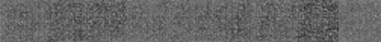

# README

#### About
A library using Julia's Flux Library to implement Variational Auto-Encoders
- main.jl - run model with MINST dataset, this will be dropped later
- Model.jl the basic Model, for now it's just a basic VAE
- Dataset.jl the interface

#### Open Questions
- Can KL-Divergence and reconstruction error be better balanced?
- Can VAE be used as a pure clustering method?
- Is it possible (in Julia) to reconconstruct the reverse transformation (decoder), for a given encoder?
- Can VAE be used for columnar data with missing inputs?

#### References
[Tutorial on VAE](https://arxiv.org/pdf/1606.05908.pdf)
[Tensorflow VAE](python/examples/generative_examples/cvae.ipynb)
[Flux.jl](https://fluxml.ai/Flux.jl/stable/)
[Flux VAE](https://github.com/FluxML/model-zoo/blob/master/vision/mnist/vae.jl)
[Auto-Encoding Variational Bayes](https://arxiv.org/abs/1312.6114)
[Stochastic Backpropagation and Approximate Inference in Deep Generative Models](https://arxiv.org/abs/1401.4082)
